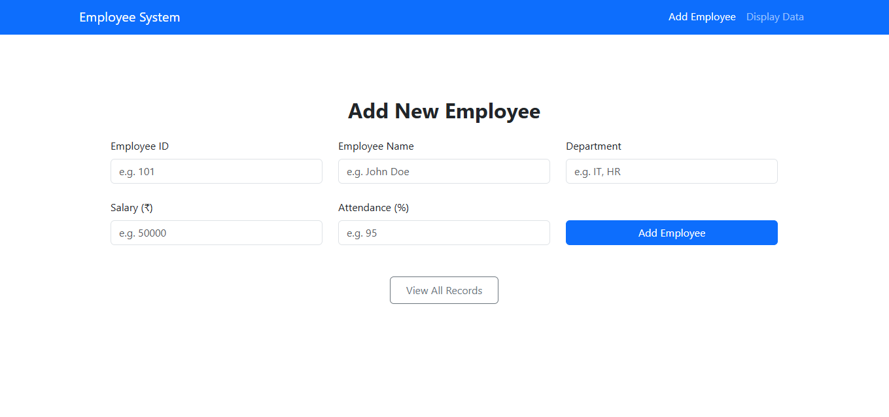
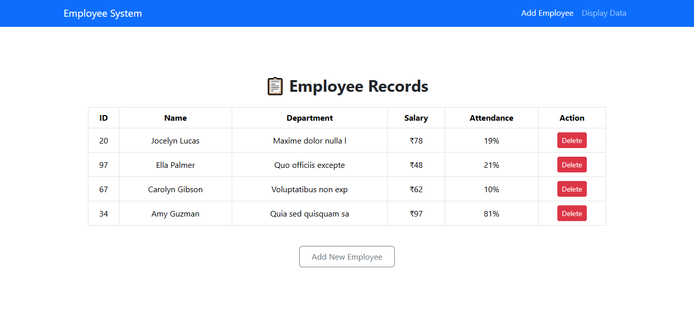
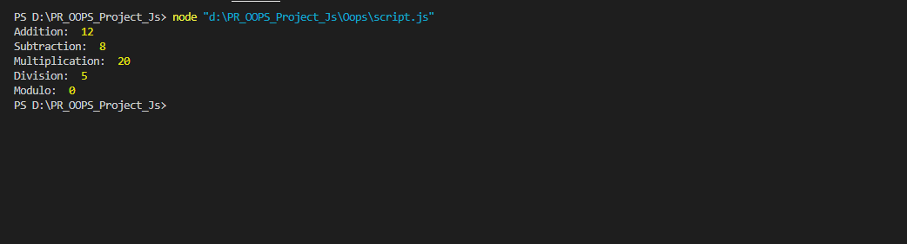
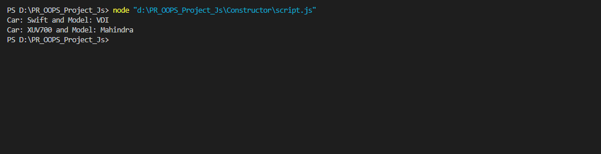
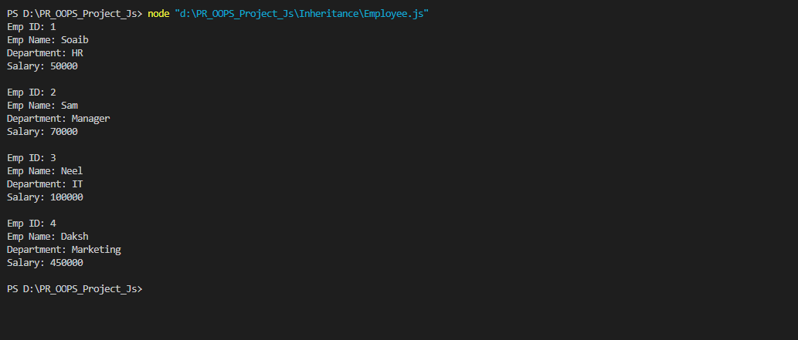
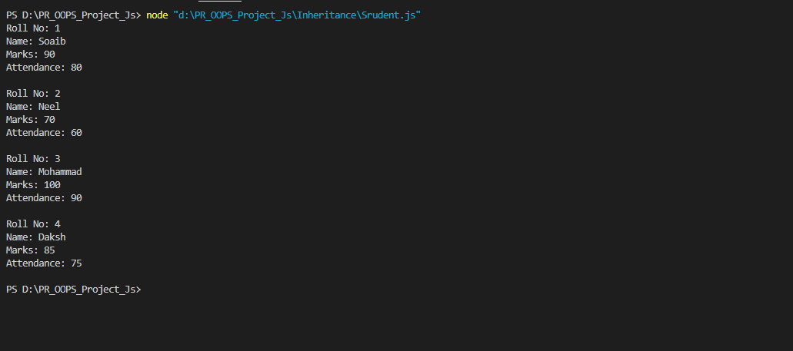
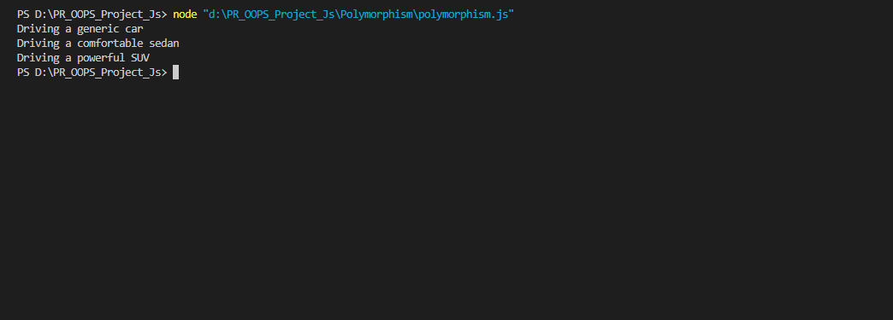
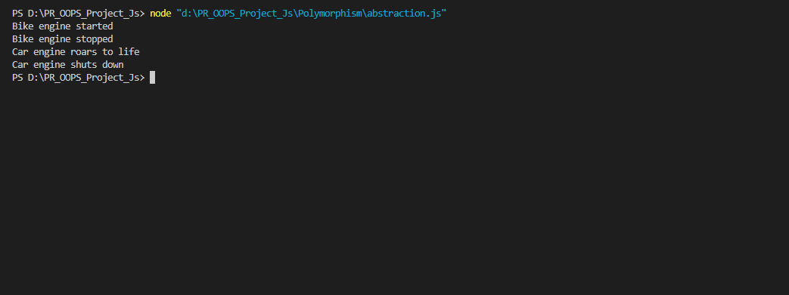

Ingheritance Project Link Here : https://pr-oops-project-js-ux9q.vercel.app/

1. Add Employee

2. Display Employee

3. Class & Object 

4. Constructor  

5. Inheritance

Employee Details

Student Details

6. Polymorphism

7. Abstraction

# OOPS Concepts in JavaScript Project

This project demonstrates core Object-Oriented Programming (OOPS) concepts in JavaScript, including Constructor, Inheritance, Polymorphism, and Abstraction. The workspace contains HTML and JavaScript files organized into folders by concept.

## File Types
- `.html` files: User interfaces for data entry and display (run in a web browser)
- `.js` files: JavaScript code implementing OOPS concepts and dynamic functionality

## How to Run
Open the HTML files (e.g., `index.html`, `student.html`, `addemployee.html`, `displaydata.html`) in a web browser. The JavaScript files are linked and run automatically in the browser.

## Features
- Add, display, and delete employee and student records using forms and tables
- Demonstrates class inheritance, method overriding, and abstraction
- Uses localStorage for persistent data in employee modules
- Clean UI with Bootstrap and Tailwind CSS
